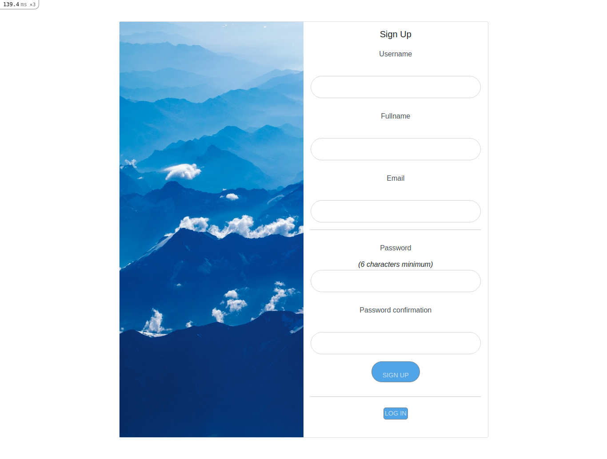
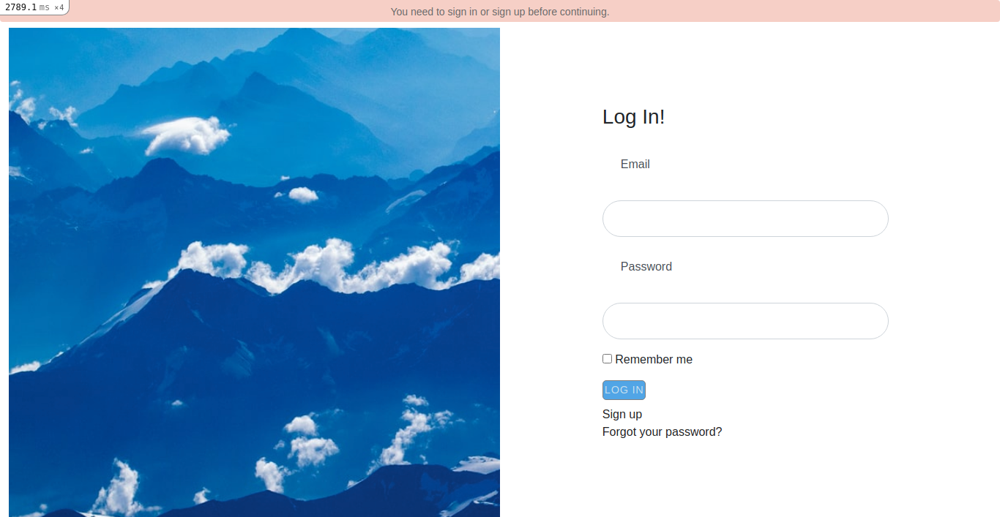
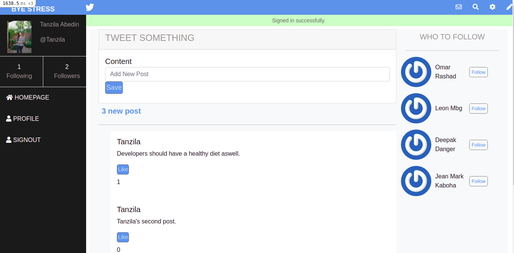
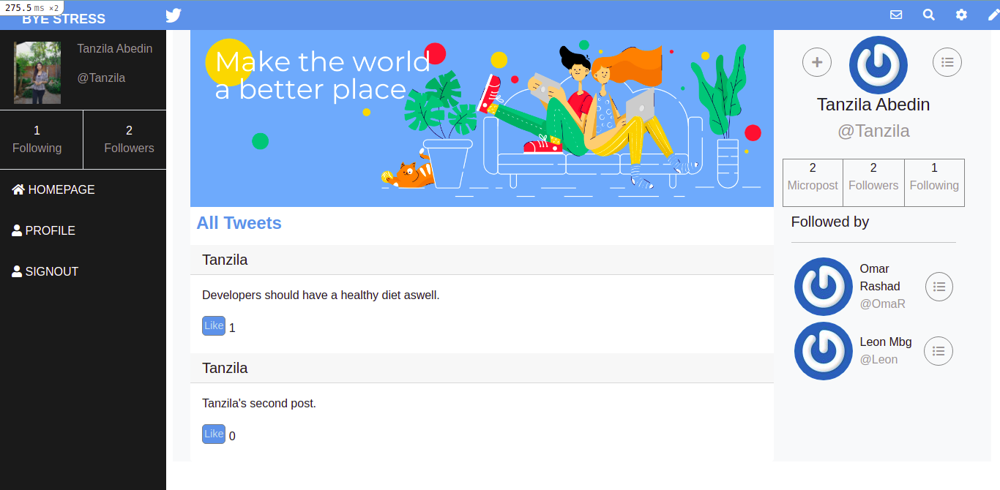

# Bye Stress


<br />

### Built With

* [RUBY]
* [RAILS]
* [DEVISE]
* [RSPEC]
* [BOOTSTRAP]
* [POSTGRESQL]


<!-- ABOUT THE PROJECT   -->
## About The Project
This project is built for the Ruby on Rails capstone which is based on a redesign of Twitter.
 It is a web application to share opinions about ways developers can overcome their daily stress.

## Screenshot Test

## Sign Up
<p align="center">
  
</p>

## Log In
<p align="center">
  
</p>

## Index page

<p align="center">
  
</p>

## User page
<p align="center">
  
</p>

## Live Demo

- [Live Demo Link](https://protected-sea-41317.herokuapp.com/)

## Contributing

Contributions make the open-source community such an amazing place to learn, inspire, and create. Any contributions you make are **greatly appreciated**.

## Prequisites

Ruby & Rails installed on your local machine.
Bundle installed on your machine
Terminal or similar to execute the program.


## Getting Started


## Clone project

- To get a local copy up and running follow these simple example steps.
- Clone this repository with git clone ```https://github.com/tanzila-abedin/capstone-byestress.git``` using your terminal or command line.
- Change to the project directory by entering: ```cd capstone-byestress``` in the terminal.

## How to use the Bye-stress app
1. run the command ```bundle install```   This will install the required dependencies
2. run the command ```rails webpacker:install ``` This will install the webpack to avoid specific rails => 6 problems
3. run the command ```rails db:create``` This will initialize the necessary migration files
4. run the command ```rails db:migrate``` 
5. run the command ```rails server```

## Command line steps
```
- $ git clone `$ git clone https://github.com/tanzila-abedin/capstone-byestress.git`
- $ git checkout develop
- $ cd capstone-byestress`
- $ bundle 
- $ rails webpacker:install 
- $ rails db:create
- $ rails db:migrate
- $ rails server
```

## Testing
In this project, the testing was done using RSpec to test logic specs.

## Install
- In a terminal window type gem install RSpec
- Once RSpec install has finished, type RSpec --init
- You will see a folder spec and a file .rspec
- Inside spec folder, you'll see a spec_helper.rb file.

## Run
The testing files are included in spec folders.
- Inside your terminal type: rspec spec/*
- Type rspec spec/* to run all tests
 
- All test should pass

## Command line Rspec steps
```
- $ gem install rspec
- $ rspec spec/*
- $ 15 examples, 0 failures

```

👤 **Tanzila**


- GitHub: [@githubhandle](https://github.com/tanzila-abedin)
- Twitter: [@twitterhandle](https://twitter.com/TanzilaAbedin)
- LinkedIn: [Profile](https://www.linkedin.com/in/tanzila-abedin-331440b2/)

<!-- ACKNOWLEDGEMENTS -->
## Acknowledgements

* [Microverse](https://www.microverse.org/)
* Design idea by [Gregoire Vella on Behance](https://www.behance.net/gregoirevella)


{"mode":"full","isActive":false}
